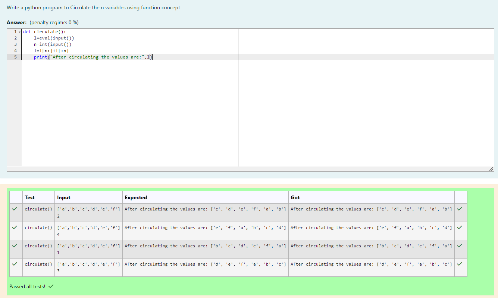

# Circulate-the-values-of-N-variables
NAME : DEVA DHARSHINI I

REGISTER NUMBER: 212223240026

DEPT: AIML

## Aim:
To write a python program to circulate the n variables using function concept
## Equipment’s required:
PC
Anaconda - Python 3.7
## Algorithm: 
### Step 1: 
Define function circulate().
### Step 2: 
Get the input from the user for the list.
### Step 3: 
Get the value from the user for the number of rotation
### Step 4: 
Using the slicing concept rotate the list

### Step 5: 
Print the result.

### Step 6:
Call the function circulate().

## Program:
```
#Program to circulate N values.
#Developed by: DEVA DHARSHINI I
#RegisterNumber: 212223240026
def circulate():
    l=eval(input())
    n=int(input())
    out=l[n:]+l[:n]
    print("After circulating the values are: {}".format(out))
```
## Output:



## Result:
The result has been successfully verified.